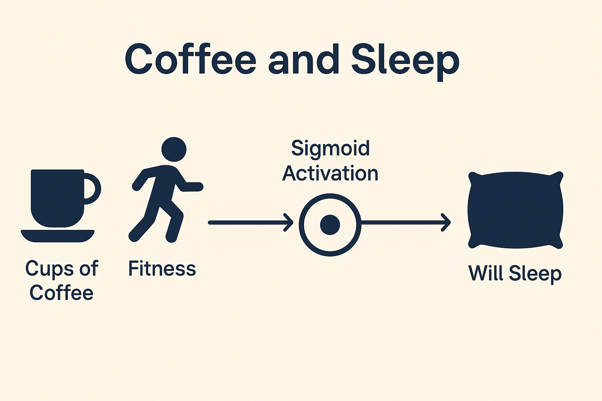

# Machine Learning Projects 


## 🚗 Carvana Car Price Prediction with Machine Learning


Welcome to the **Carvana Car Price Prediction** project! This repository walks you through building a robust machine learning pipeline using Python to predict car prices based on real-world data. You'll clean and preprocess the dataset, apply encoding techniques, and train predictive models like **Linear Regression** and **Random Forest Regressor**.

## 📌 Features

* Data cleaning and preprocessing with **Pandas**
* Handling categorical variables using:

  * One-Hot Encoding
  * Label Encoding
* Training and comparing:

  * Linear Regression
  * Random Forest Regressor
* Evaluation using **Mean Squared Error (MSE)**
* Hosted in **Google Colab** for an interactive, cloud-based experience

## 🛠 Tools & Libraries

* Python 🐍
* Pandas
* Scikit-learn
* Google Colab

[Download Notebook](Carvana.ipynb)


Thanks for sharing the second notebook! Here's a well-crafted `README.md` for the **Heart Disease Prediction** project:

---

## ❤️ Heart Disease Prediction with Machine Learning


This project aims to predict the presence of heart disease using patient data and various machine learning models. With a focus on preprocessing, model training, and evaluation, this notebook offers a hands-on walkthrough using real-world data and popular ML techniques.

## 📌 Key Features

* Preprocessing and visualization of heart disease dataset
* Binary classification using:

  * Logistic Regression
  * K-Nearest Neighbors (KNN)
  * Random Forest
* Performance metrics:

  * Accuracy
  * Confusion Matrix
  * ROC Curve
* Model comparison to find the most accurate predictor

## 🛠 Technologies Used

* Python
* Pandas
* NumPy
* Matplotlib & Seaborn
* Scikit-learn

[Download](Heart_Desease.ipynb)


---  



## ☕ Coffee and Sleep 💤

This project explores how coffee consumption and physical fitness affect the likelihood of sleeping well, using a simple neural network built with Keras.

## 📓 Notebook

The main notebook is:
[Download Notebook](CoffeeAndSleep.ipynb)

It walks through:

* Creating a synthetic dataset of `cups_of_coffee`, `fitness`, and `will_sleep` (binary outcome).
* Building a neural network using `TensorFlow` and `Keras`.
* Training a simple model with one dense sigmoid neuron.
* Visualizing training and validation loss.

## 🧠 Model Summary

The neural network consists of:

```python
model = Sequential([
    Dense(1, activation='sigmoid', input_shape=(2,))
])
```

* **Inputs**: 2 (cups of coffee, fitness score)
* **Output**: Probability of sleeping (0 or 1)
* **Activation**: Sigmoid

## 🛠️ Requirements

Install dependencies with:

```bash
pip install -r requirements.txt
```

Or manually:

```bash
pip install numpy pandas matplotlib scikit-learn tensorflow
```

## ▶️ How to Run

Launch the notebook using:

```bash
jupyter notebook CoffeeAndSleep.ipynb
```

## 📊 Sample Output

The model trains over 50 epochs and provides accuracy and loss metrics. You’ll also see a loss curve plotted for training vs. validation.

## 📂 Dataset

Synthetic data is generated within the notebook. Each row contains:

* `cups_of_coffee`: integer (e.g., 0 to 8)
* `fitness`: score from 0 to 100
* `will_sleep`: binary label (0 = no, 1 = yes)


